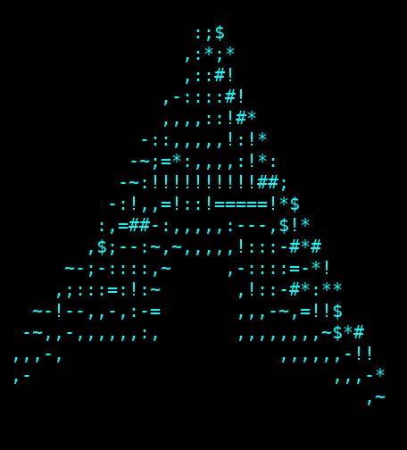
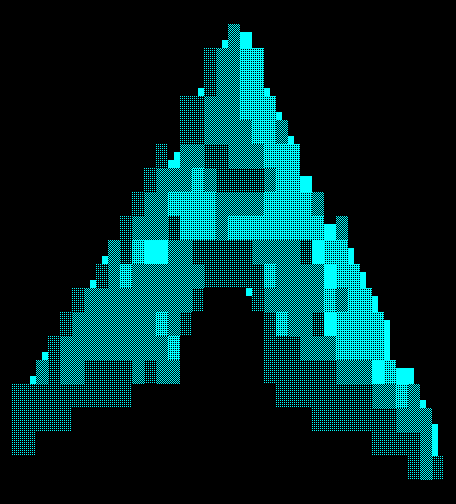

# Shading modes

fetch supports three shading modes for the 3D rendering. ASCII is the default.

## ASCII (default)

Brightness is mapped onto the character ramp `.,-~:;=!*#$@`, one character per cell. This is the classic donut.c look.

```
fetch --shading-mode ascii
```



## Blocks

Coverage is sampled on a 2x2 grid per cell, using Unicode quadrant blocks (`▘▝▀▖▌▞▛▗▚▐▜▄▙▟█`). Edges land on half-cell boundaries instead of snapping to the character grid.

Works on any terminal with a UTF-8 locale.

```
fetch --shading-mode blocks
```


## Sextants

Coverage is sampled on a 2x3 grid per cell, using Unicode block sextants (U+1FB00). This gives the sharpest edges.

Needs a terminal that draws the Symbols for Legacy Computing block: kitty, Ghostty, foot, and WezTerm do this themselves so the font doesn't matter.

```
fetch --shading-mode sextants
```



## Config

Set the mode in `~/.config/fetch/config`:

```
shading_mode=ascii
```

Or use a custom ASCII ramp:

```
shading=.,-~:;=!*#$@
```

Setting `shading=` implies ASCII mode. `--shading-chars` on the CLI does the same.
